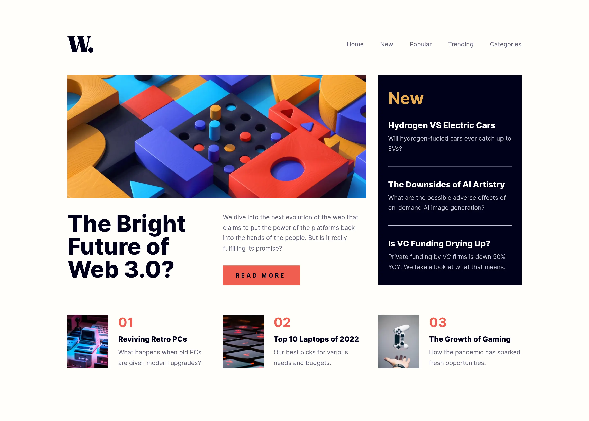
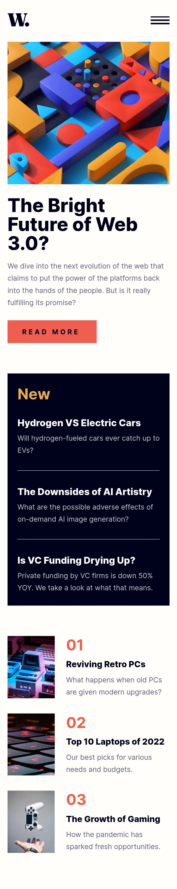

# Frontend Mentor - News homepage solution

This is a solution to the [News homepage challenge on Frontend Mentor](https://www.frontendmentor.io/challenges/news-homepage-H6SWTa1MFl). Frontend Mentor challenges help you improve your coding skills by building realistic projects.

## Table of contents

- [Overview](#overview)
  - [The challenge](#the-challenge)
  - [Screenshots](#screenshots)
  - [Links](#links)
- [My process](#my-process)
  - [Built with](#built-with)
  - [Useful resources](#useful-resources)
- [Author](#author)

## Overview

### The challenge

Users should be able to:

- View the optimal layout for the interface depending on their device's screen size
- See hover and focus states for all interactive elements on the page

### Screenshots

### Links

- Solution URL: [Solution URL here](https://github.com/OniOdd/news-homepage)
- Live Site URL: [Live site URL here](https://oniodd.github.io/news-homepage/)

## My process

### Built with

- Semantic HTML5 markup
- CSS custom properties
- Flexbox
- CSS Grid
- Mobile-first workflow
- BEM
- SASS (SCSS)
- JavaScript

### Useful resources

- [MDN Web Docs](https://developer.mozilla.org/) - A useful informative resource.
- [Code Guide](https://codeguide.co/) - Standards for developing consistent, flexible, and sustainable HTML and CSS.
- [w3schools](https://www.w3schools.com/) - The world's largest web developer site.

## Author

- LinkedIn - [Mykyta Kavetskyi](https://www.linkedin.com/in/mykyta-kavetskyi/)
- Frontend Mentor - [@OniOdd](https://www.frontendmentor.io/profile/OniOdd)
